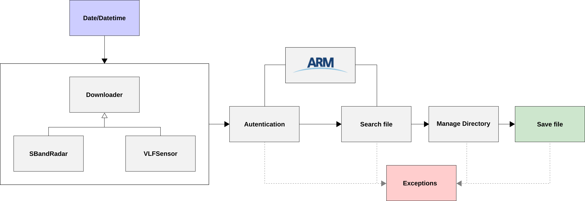

<h1 align="center">Go Amazon Downloader Data</h1>
<div align="center">
  <strong>A Python Library for download data from campaign Green Ocean Amazon</strong>
</div>

<h3 align="center">Developer</h3>
<div align="center">
  <strong>
    <a href="https://github.com/AdrianoPereira">AdrianoPereira</a> &emsp;
  </strong>
</div>

---



### Features
- Download S-Band Radar (SIPAM)
- Download Very Low Frequency Sensor (STARNET)

For the time being, only the modules to download the files from S-Band Randar (SIPAM) and Very Low 
Frequency have been implemented.

##

### Installation

Via pip:
```console
pip install goamazondownloader
```

Via source code:
```console
git clone https://github.com/AdrianoPereira/goamazondownloader.git
cd goamazondownloader
python setup.py install
```
**Dependencies**
- requests
- beautifulsoup4

##
### Usage
The files are hosted on the [ARM](https://www.arm.gov/research/campaigns/amf2014goamazon) website. 
To download the files it is necessary to have a registration. Registration can be done quickly through the following 
link: [https://adc.arm.gov/armuserreg/#/new](https://adc.arm.gov/armuserreg/#/new).

**Download S-Band Radar (SIPAM)**

```python
from goamazondownloader import SBandRadar

downloader = SBandRadar(year=2014, month=2, day=18, hour=15, minute=0)
downloader.obj.login(username="<username>") # <username> maybe your username or e-mail
downloader.set_remote_url()
downloader.download()

```

**Downloader Very Low Frequency Sensor (STARNET)**
```python
from goamazondownloader import VLFSensor

downloader = VLFSensor(year=2014, month=2, day=18)
downloader.login("username") # # <username> maybe your username or e-mail
downloader.set_remote_url()
downloader.download()

```
##

### Contributing
Thank you for being interested on making this package better. I encourage everyone to help improving this project with 
some new features, bug fixes and performance issues. 

##

### Need help?
If you need help with GoAmazon Downloader, please open an issue with a description of the problem you're facing. 

##

### License
[MIT](LICENSE) (c) 2020